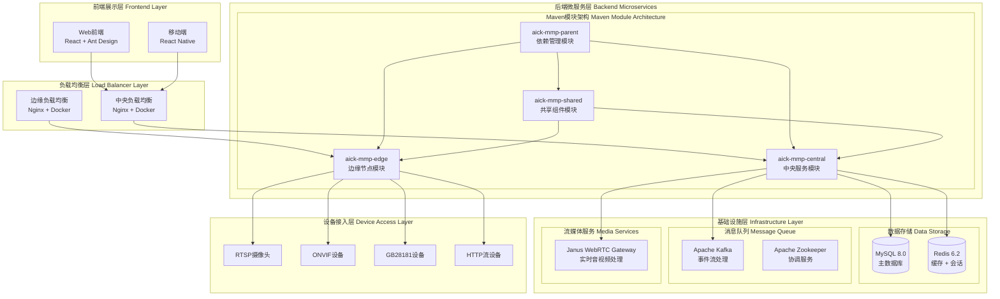
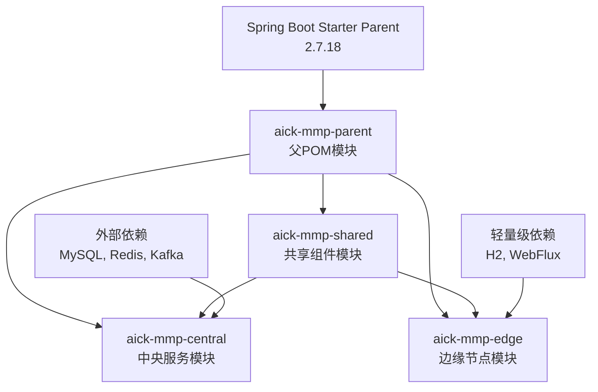
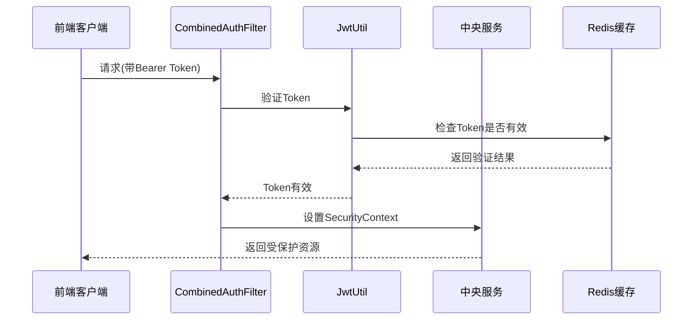
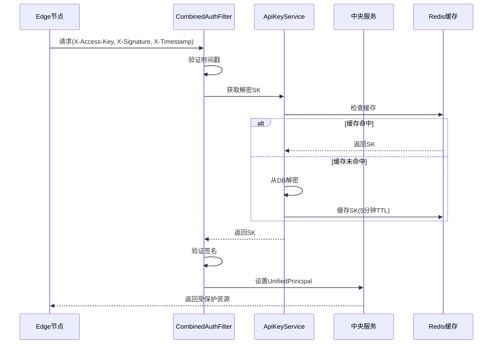
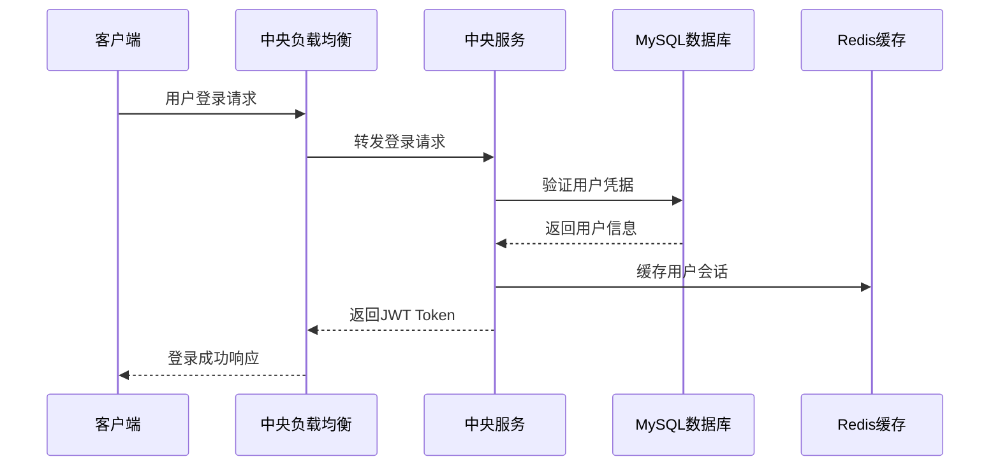
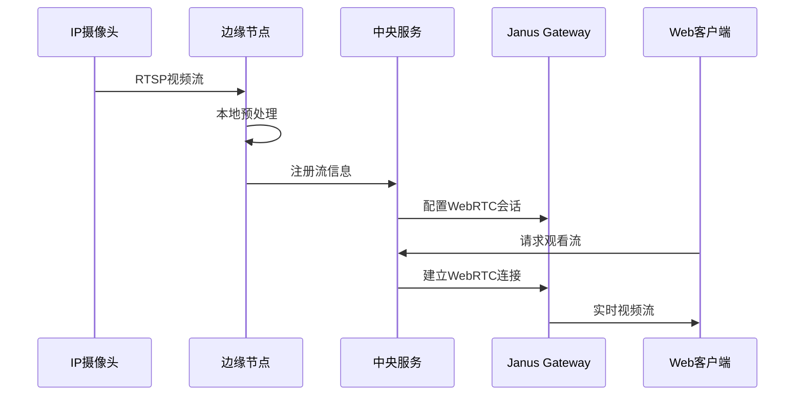
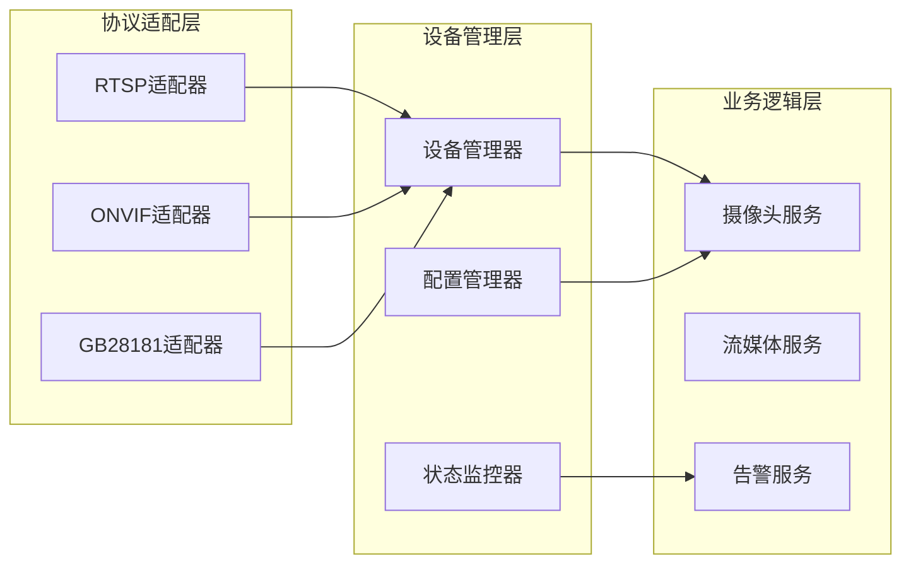
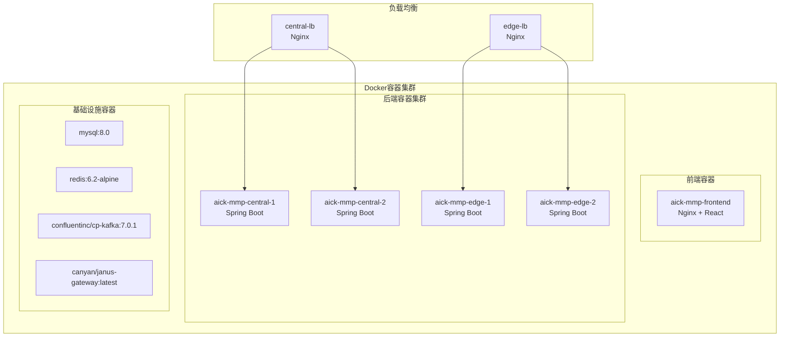

# AICK-MMP 多区域视频监控平台 - 架构设计文档

## 1. 系统架构概览

### 1.1 整体架构图



### 1.2 核心组件说明

| 组件层次 | 组件名称 | 功能描述 | 技术栈 |
|---------|----------|----------|--------|
| **前端展示层** | Web前端 | 用户交互界面，视频墙显示 | React 18, Ant Design 5.x, WebRTC |
| **负载均衡层** | Nginx集群 | 请求路由，负载均衡，SSL终止 | Nginx, Docker, SSL/TLS |
| **微服务层** | aick-mmp-parent | Maven依赖统一管理 | Maven, Spring Boot Parent |
| **微服务层** | aick-mmp-shared | 共享模型、工具、协议适配器 | Spring Boot 2.7.18, JPA |
| **微服务层** | aick-mmp-central | 中央业务逻辑，API网关 | Spring Boot, Spring Security, JWT |
| **微服务层** | aick-mmp-edge | 边缘计算节点，设备接入 | Spring Boot, 轻量级配置 |
| **基础设施层** | 数据存储 | 持久化存储和缓存 | MySQL 8.0, Redis 6.2 |
| **基础设施层** | 消息队列 | 事件驱动通信 | Apache Kafka, Zookeeper |
| **基础设施层** | 流媒体服务 | WebRTC音视频处理 | Janus Gateway |

## 2. 模块化架构设计

### 2.1 Maven模块结构

```
backend/
├── pom.xml                      # 主聚合器POM
├── aick-mmp-parent/            # 父依赖管理模块
│   └── pom.xml                 # 统一版本管理
├── aick-mmp-shared/            # 共享组件模块
│   ├── src/main/java/com/aick/mmp/shared/
│   │   ├── model/              # 共享数据模型(User, Camera, EdgeNode等)
│   │   ├── adapter/            # 协议适配器(RTSP, ONVIF, GB28181)
│   │   ├── dto/                # 共享数据传输对象
│   │   ├── config/             # 共享配置类
│   │   └── util/               # 工具类和常量
│   └── pom.xml
├── aick-mmp-central/           # 中央服务模块
│   ├── src/main/java/com/aick/mmp/central/
│   │   ├── controller/         # REST API控制器
│   │   ├── service/            # 业务逻辑服务
│   │   ├── repository/         # 数据访问层
│   │   ├── config/             # 中央服务配置
│   │   └── CentralApplication.java
│   └── pom.xml
└── aick-mmp-edge/              # 边缘节点模块
    ├── src/main/java/com/aick/mmp/edge/
    │   ├── controller/         # 边缘API控制器
    │   ├── service/            # 边缘业务逻辑
    │   ├── config/             # 边缘节点配置
    │   └── EdgeApplication.java
    └── pom.xml
```

### 2.2 模块依赖关系



### 2.3 模块职责划分

#### 2.3.1 aick-mmp-parent 模块
- **职责**：统一依赖版本管理
- **功能**：
  - 定义所有依赖的版本号
  - 配置公共插件
  - 提供构建配置模板

#### 2.3.2 aick-mmp-shared 模块  
- **职责**：提供共享组件和工具
- **功能**：
  - 数据模型定义（User, Camera, EdgeNode, StreamSession等）
  - 协议适配器（RTSP, ONVIF, GB28181适配器）
  - 公共DTO和配置类
  - 工具类和常量定义

#### 2.3.3 aick-mmp-central 模块
- **职责**：中央服务和API管理
- **功能**：
  - 用户认证和权限管理
  - 摄像头和边缘节点管理
  - 视频流调度和分发
  - 系统监控和告警
  - 数据持久化和缓存

#### 2.3.4 aick-mmp-edge 模块
- **职责**：边缘计算和设备接入
- **功能**：
  - 本地摄像头接入和管理
  - 边缘视频预处理
  - 设备状态监控和上报
  - 本地缓存和轻量级存储

## 3. 核心功能架构

### 3.1 用户认证与权限管理

#### 3.1.1 认证体系概述

系统支持两种认证方式：
- **JWT认证**：适用于前端用户登录
- **AK/SK认证**：适用于Edge节点和系统间通信

#### 3.1.2 JWT认证流程



#### 3.1.3 AK/SK认证流程



#### 3.1.4 签名字符串构造

```
StringToSign = HTTP_METHOD + "\n" + REQUEST_PATH + "\n" + TIMESTAMP

示例:
POST
/api/edge/register
2026-04-05T10:00:00Z
```

签名算法：HMAC-SHA256，结果Base64编码

### 3.2 统一身份（UnifiedPrincipal）

为了支持JWT和AK/SK两种认证方式的统一授权，系统引入了UnifiedPrincipal：

```java
UnifiedPrincipal {
    identityId: String        // 用户ID或API Key ID
    identityType: Enum       // USER / SYSTEM_APP
    authMethod: Enum         // JWT / API_KEY
    role: String             // 角色（如ADMIN、OPERATOR）
    permissions: Set         // 权限集合
}
```



### 3.2 视频流处理架构



### 3.3 设备管理架构



## 4. 部署架构

### 4.1 容器化部署策略



### 4.2 环境配置

| 环境 | 中央服务配置 | 边缘节点配置 | 资源要求 |
|------|-------------|-------------|----------|
| **开发环境** | 单实例部署 | 单实例调试 | 4GB RAM, 2 CPU |
| **测试环境** | 双实例集群 | 多节点测试 | 8GB RAM, 4 CPU |
| **生产环境** | 高可用集群 | 分布式部署 | 16GB+ RAM, 8+ CPU |

## 5. 性能优化策略

### 5.1 模块化性能优化

- **共享模块**：最小化依赖，提高加载速度
- **中央服务**：连接池优化，缓存策略，异步处理
- **边缘节点**：内存优化，轻量级运行时，本地缓存

### 5.2 资源分配策略

| 模块类型 | 内存分配 | CPU分配 | 存储要求 |
|---------|----------|---------|----------|
| aick-mmp-central | 2GB+ | 2+ cores | 高I/O SSD |
| aick-mmp-edge | 512MB | 1 core | 本地存储 |
| aick-mmp-shared | 作为依赖 | 作为依赖 | 无独立要求 |

## 6. 安全架构

### 6.1 认证体系

#### 6.1.1 认证方式

| 认证方式 | 适用场景 | 实现方式 |
|----------|----------|----------|
| JWT认证 | 前端用户登录 | Bearer Token |
| AK/SK认证 | Edge节点、系统间通信 | HTTP头签名 |

#### 6.1.2 密钥管理

| 密钥类型 | 存储方式 | 安全措施 |
|----------|----------|----------|
| JWT密钥 | Redis | 定期轮换 |
| SK（用户） | AES-256-GCM加密 | 主密钥配置化 |
| SK（系统） | AES-256-GCM加密 | 主密钥配置化+Redis缓存 |

#### 6.1.3 Edge节点认证

- 超级管理员创建SystemApp
- 为SystemApp生成ApiKey（AK/SK）
- Edge节点配置AK/SK
- 所有请求携带签名头

### 6.2 模块间安全通信

- **JWT认证**：中央服务与前端通信
- **AK/SK认证**：Edge节点与中央服务通信
- **设备认证**：边缘节点与设备间的安全连接

### 6.3 数据安全

- **传输加密**：TLS/SSL加密所有网络通信
- **存储加密**：敏感数据数据库级加密（SK使用AES-256-GCM）
- **访问控制**：基于角色的细粒度权限控制（RBAC）
- **签名验证**：HMAC-SHA256防篡改
- **时间戳验证**：防止重放攻击（±5分钟容差）

## 7. 监控与运维

### 7.1 应用监控

- **模块健康检查**：Spring Boot Actuator健康检查
- **性能监控**：JVM指标，应用指标监控
- **日志聚合**：集中式日志收集和分析

### 7.2 基础设施监控

- **容器监控**：Docker容器资源使用监控
- **网络监控**：服务间网络延迟和吞吐量
- **存储监控**：数据库和缓存性能监控

---

> **文档版本**: v2.0  
> **更新日期**: 2025-08-26  
> **维护者**: AICK Technology Team