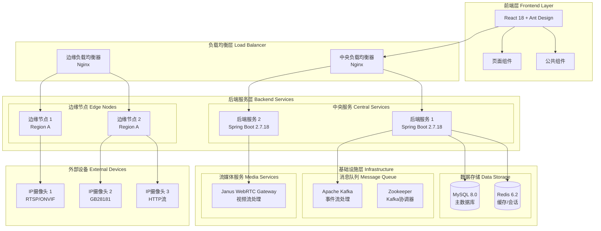

# AICK-MMP 多区域视频监控平台

<div align="center">
  <h3>企业级分布式视频监控解决方案</h3>
  <p>基于微服务架构的多区域视频监控管理平台，支持实时视频流传输、边缘计算和智能运维</p>
</div>

<div align="center">

[]()
[]()
[]()
[]()
[]()

</div>

## 📖 项目简介

AICK-MMP（AI Camera Kit - Multi-region Monitoring Platform）是一个企业级的多区域视频监控管理平台，采用现代微服务架构设计，专为大规模分布式监控场景而构建。

### 🎯 核心价值

- **🌍 多区域支持**：支持跨地域的摄像头统一管理和实时监控
- **⚡ 低延迟传输**：基于WebRTC技术实现<200ms的实时视频传输
- **🔄 边缘计算**：本地视频预处理，减少网络带宽占用
- **📱 统一平台**：Web端统一管理界面，支持多画面同时观看
- **🔧 智能运维**：自动故障检测、负载均衡和性能监控

### 🏆 适用场景

- 连锁企业多门店监控管理
- 工业园区安防监控系统
- 智慧城市视频监控网络
- 大型项目工地安全监管
- 物流仓储安防管理

## 🏗️ 系统架构

### 总体架构图



### 核心组件说明

| 组件 | 功能描述 | 技术栈 |
|------|----------|--------|
| **前端展示层** | 用户界面和交互逻辑 | React 18, Ant Design, WebRTC |
| **API网关层** | 负载均衡和请求路由 | Nginx, Docker |
| **业务服务层** | 核心业务逻辑处理 | Spring Boot 2.7.18, Spring Security |
| **边缘计算层** | 本地视频预处理 | 边缘节点服务, 协议适配器 |
| **数据存储层** | 持久化和缓存 | MySQL 8.0, Redis 6.2 |
| **消息队列层** | 异步消息处理 | Apache Kafka, Zookeeper |
| **流媒体层** | 视频流处理 | Janus WebRTC Gateway |

## 🚀 功能特性

### 📹 视频监控功能

- [x] **多协议支持**：RTSP、ONVIF、GB28181、HTTP等主流协议
- [x] **实时预览**：WebRTC低延迟实时视频预览
- [x] **多画面显示**：支持1/4/9/16画面同时显示
- [x] **画面切换**：快速画面切换和全屏显示
- [x] **录像回放**：历史录像查看和下载
- [x] **画质调节**：动态调整视频质量和码率

### 🌐 设备管理功能

- [x] **摄像头管理**：设备添加、配置、状态监控
- [x] **边缘节点管理**：节点注册、健康检查、负载监控
- [x] **协议适配**：自动识别设备协议并适配
- [x] **批量操作**：设备批量导入、配置和管理
- [x] **设备分组**：按区域、类型等维度分组管理

### 👥 用户权限功能

- [x] **用户认证**：JWT Token身份验证
- [x] **角色管理**：系统管理员、操作员、观察员等角色
- [x] **权限控制**：细粒度权限控制和资源访问
- [x] **操作审计**：完整的操作日志记录

### 📊 系统监控功能

- [x] **实时监控**：系统性能、网络状态实时监控
- [x] **告警通知**：设备故障、网络异常自动告警
- [x] **性能统计**：带宽使用、CPU、内存等性能指标
- [x] **健康检查**：服务健康状态自动检测

## 💻 技术栈

### 后端技术栈

| 技术 | 版本 | 用途 |
|------|------|------|
| **Java** | 8 | 主要编程语言 |
| **Spring Boot** | 2.7.18 | 微服务框架 |
| **Spring Security** | 5.x | 安全认证框架 |
| **Spring Data JPA** | 2.7.x | 数据持久层 |
| **MySQL** | 8.0 | 主数据库 |
| **Redis** | 6.2 | 缓存和会话存储 |
| **Apache Kafka** | 7.4.0 | 消息队列 |
| **Janus Gateway** | Latest | WebRTC媒体服务器 |
| **Maven** | 3.6+ | 构建工具 |
| **Docker** | Latest | 容器化部署 |

### 前端技术栈

| 技术 | 版本 | 用途 |
|------|------|------|
| **React** | 18.2.0 | 前端框架 |
| **Ant Design** | 5.8.6 | UI组件库 |
| **React Router** | 6.16.0 | 路由管理 |
| **Axios** | 1.5.0 | HTTP客户端 |
| **WebRTC** | Latest | 实时音视频通信 |
| **Chart.js** | 4.4.0 | 图表组件 |
| **Socket.IO** | 4.7.2 | 实时通信 |

## 📦 快速开始

### 环境要求

- **Java**: 8 或更高版本
- **Node.js**: 14 或更高版本
- **Maven**: 3.6 或更高版本
- **Docker**: 20.10 或更高版本
- **Docker Compose**: 1.29 或更高版本

### 安装部署

#### 1. 克隆项目

```bash
git clone https://github.com/HuboryChen/aick-mmp.git
cd aick-mmp
```

#### 2. 后端构建

```bash
cd backend
mvn clean package -DskipTests
cd ..
```

#### 3. 前端构建（可选，Docker部署时自动构建）

```bash
cd frontend
npm install --legacy-peer-deps
npm run build
cd ..
```

#### 4. 容器化部署

```bash
# 启动所有服务
docker-compose up -d

# 查看服务状态
docker-compose ps

# 查看日志
docker-compose logs -f
```

#### 5. 服务验证

```bash
# 检查后端服务
curl http://localhost:8080/api/health

# 检查前端服务
curl http://localhost:80
```

### 开发环境启动

#### 后端开发环境

```bash
# 启动基础服务（MySQL, Redis, Kafka）
docker-compose up -d mysql redis kafka zookeeper janus

# 启动后端服务
cd backend
mvn spring-boot:run
```

#### 前端开发环境

```bash
cd frontend
npm install --legacy-peer-deps
npm start
```

## 🔧 配置说明

### 环境变量配置

| 变量名 | 默认值 | 说明 |
|--------|--------|------|
| `SPRING_PROFILES_ACTIVE` | prod | 运行环境 (dev/test/prod) |
| `SPRING_DATASOURCE_URL` | - | 数据库连接URL |
| `SPRING_REDIS_HOST` | redis | Redis主机地址 |
| `JANUS_SERVER_URL` | http://janus:8088 | Janus服务器地址 |
| `NODE_ID` | - | 节点唯一标识 |
| `ZONE` | - | 部署区域标识 |

### 端口映射

| 服务 | 内部端口 | 外部端口 | 说明 |
|------|----------|----------|------|
| 前端Web | 80 | 80 | 主要访问入口 |
| 中央负载均衡 | 80 | 8080 | API网关 |
| 边缘负载均衡 | 80 | 8083 | 边缘节点API |
| MySQL | 3306 | 3306 | 数据库服务 |
| Redis | 6379 | 6379 | 缓存服务 |
| Kafka | 9092 | 9092 | 消息队列 |
| Janus HTTP | 8088 | 8088 | WebRTC HTTP |
| Janus WebSocket | 8188 | 8188 | WebRTC WebSocket |
| Janus Admin | 8089 | 8089 | Janus管理接口 |

## 📚 系统访问

### Web界面

- **主要入口**: http://localhost:80
- **管理后台**: http://localhost:8080
- **边缘节点**: http://localhost:8083

### 默认账户

- **管理员**: admin / admin123
- **操作员**: operator / operator123
- **观察员**: viewer / viewer123

## 📁 项目结构

```
aick-mmp/
├── backend/                 # 后端服务
│   ├── src/main/java/com/aick/mmp/
│   │   ├── adapter/         # 协议适配器
│   │   ├── config/          # 配置类
│   │   ├── controller/      # 控制器
│   │   ├── dto/             # 数据传输对象
│   │   ├── model/           # 数据模型
│   │   ├── repository/      # 数据访问层
│   │   ├── service/         # 业务逻辑层
│   │   └── util/            # 工具类
│   ├── Dockerfile           # 后端容器配置
│   └── pom.xml              # Maven配置
├── frontend/                # 前端应用
│   ├── public/              # 静态资源
│   ├── src/
│   │   ├── components/      # 公共组件
│   │   ├── pages/           # 页面组件
│   │   ├── App.js           # 主应用组件
│   │   └── index.js         # 入口文件
│   ├── Dockerfile           # 前端容器配置
│   └── package.json         # NPM配置
├── nginx/                   # 负载均衡配置
│   ├── central-lb.conf      # 中央负载均衡
│   └── edge-lb.conf         # 边缘负载均衡
├── janus/                   # Janus配置
│   └── janus.cfg            # Janus服务配置
├── docker-compose.yml       # 容器编排配置
├── ARCHITECTURE.md          # 架构设计文档
├── IMPLEMENTATION_PLAN.md   # 实施计划
└── README.md                # 项目说明文档
```

## 🔍 API文档

### 认证相关

```http
POST /api/auth/login          # 用户登录
POST /api/auth/logout         # 用户登出
GET  /api/auth/profile        # 获取用户信息
```

### 摄像头管理

```http
GET    /api/cameras           # 获取摄像头列表
POST   /api/cameras           # 添加摄像头
GET    /api/cameras/{id}      # 获取摄像头详情
PUT    /api/cameras/{id}      # 更新摄像头
DELETE /api/cameras/{id}      # 删除摄像头
```

### 边缘节点管理

```http
GET    /api/edge-nodes        # 获取边缘节点列表
POST   /api/edge-nodes        # 注册边缘节点
GET    /api/edge-nodes/{id}   # 获取节点详情
PUT    /api/edge-nodes/{id}   # 更新节点配置
```

### 流媒体控制

```http
POST   /api/streaming/start   # 开始视频流
POST   /api/streaming/stop    # 停止视频流
GET    /api/streaming/status  # 获取流状态
```

## 🐛 故障排除

### 常见问题

#### 1. 前端构建失败

```bash
# 清理依赖重新安装
rm -rf node_modules package-lock.json
npm install --legacy-peer-deps
```

#### 2. 后端启动失败

```bash
# 检查Java版本
java -version

# 检查端口占用
lsof -i :8080

# 查看详细错误日志
mvn spring-boot:run -X
```

#### 3. Docker服务异常

```bash
# 重启Docker服务
docker-compose down
docker-compose up -d

# 查看服务日志
docker-compose logs [服务名]

# 清理Docker资源
docker system prune -a
```

#### 4. 数据库连接失败

```bash
# 检查MySQL服务状态
docker-compose ps mysql

# 手动连接测试
mysql -h localhost -P 3306 -u aickuser -p
```

## 📄 许可证

本项目采用 [MIT](LICENSE) 许可证。

## 🤝 贡献指南

我们欢迎所有形式的贡献！请阅读 [贡献指南](CONTRIBUTING.md) 了解详情。

## 📞 联系我们

- **项目地址**: https://github.com/HuboryChen/aick-mmp
- **问题反馈**: https://github.com/HuboryChen/aick-mmp/issues
- **技术支持**: 2574164099@qq.com

---

<div align="center">
  <p>© 2025 AICK Technology. All rights reserved.</p>
  <p>如果这个项目对您有帮助，请给我们一个 ⭐</p>
</div>
