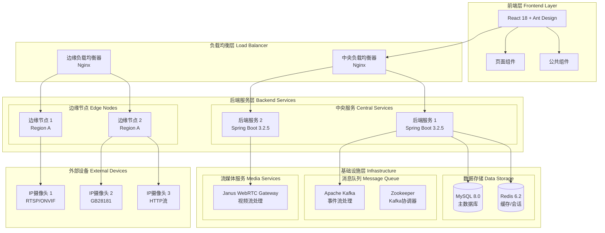

# AICK-MMP 多区域视频监控平台

<div align="center">
  <h3>企业级分布式视频监控解决方案</h3>
  <p>基于微服务架构的多区域视频监控管理平台，支持实时视频流传输、边缘计算和智能运维</p>
</div>

<div align="center">

[]()
[]()
[]()
[]()
[]()

</div>

## 📖 项目简介

AICK-MMP（AI Camera Kit - Multi-region Monitoring Platform）是一个企业级的多区域视频监控管理平台，采用现代微服务架构设计，专为大规模分布式监控场景而构建。

### 🎯 核心价值

- **🌍 多区域支持**：支持跨地域的摄像头统一管理和实时监控
- **⚡ 低延迟传输**：基于WebRTC技术实现<200ms的实时视频传输
- **🔄 边缘计算**：本地视频预处理，减少网络带宽占用
- **📱 统一平台**：Web端统一管理界面，支持多画面同时观看
- **🔧 智能运维**：自动故障检测、负载均衡和性能监控

### 🏆 适用场景

- 连锁企业多门店监控管理
- 工业园区安防监控系统
- 智慧城市视频监控网络
- 大型项目工地安全监管
- 物流仓储安防管理

## 🏗️ 系统架构

### 总体架构图


```mermaid
graph TB
    subgraph "前端层 Frontend Layer"
        UI[React 18 + Ant Design]
        UI --> Pages[页面组件]
        UI --> Components[公共组件]
    end

    subgraph "负载均衡层 Load Balancer"
        CLB[中央负载均衡器<br/>Nginx]
        ELB[边缘负载均衡器<br/>Nginx]
    end

    subgraph "后端服务层 Backend Services"
        subgraph "中央服务 Central Services"
            Backend1[后端服务 1<br/>Spring Boot 3.2.5]
            Backend2[后端服务 2<br/>Spring Boot 3.2.5]
        end
        
        subgraph "边缘节点 Edge Nodes"
            EdgeNode1[边缘节点 1<br/>Region A]
            EdgeNode2[边缘节点 2<br/>Region A]
        end
    end

    subgraph "基础设施层 Infrastructure"
        subgraph "数据存储 Data Storage"
            MySQL[(MySQL 8.0<br/>主数据库)]
            Redis[(Redis 6.2<br/>缓存/会话)]
        end
        
        subgraph "消息队列 Message Queue"
            Kafka[Apache Kafka<br/>事件流处理]
            Zookeeper[Zookeeper<br/>Kafka协调器]
        end
        
        subgraph "流媒体服务 Media Services"
            Janus[Janus WebRTC Gateway<br/>视频流处理]
        end
    end

    subgraph "外部设备 External Devices"
        Camera1[IP摄像头 1<br/>RTSP/ONVIF]
        Camera2[IP摄像头 2<br/>GB28181]
        Camera3[IP摄像头 3<br/>HTTP流]
    end

    %% 连接关系
    UI --> CLB
    CLB --> Backend1
    CLB --> Backend2
    ELB --> EdgeNode1
    ELB --> EdgeNode2
    
    Backend1 --> MySQL
    Backend1 --> Redis
    Backend1 --> Kafka
    Backend2 --> Janus
    
    EdgeNode1 --> Camera1
    EdgeNode2 --> Camera2
    EdgeNode2 --> Camera3
```

### 核心组件说明

| 组件 | 功能描述 | 技术栈 |
|------|----------|--------|
| **前端展示层** | 用户界面和交互逻辑 | React 18, Ant Design, WebRTC |
| **API网关层** | 负载均衡和请求路由 | Nginx, Docker |
| **业务服务层** | 核心业务逻辑处理 | Spring Boot 3.2.5, Spring Security |
| **边缘计算层** | 本地视频预处理 | 边缘节点服务, 协议适配器 |
| **数据存储层** | 持久化和缓存 | MySQL 8.0, Redis 6.2 |
| **消息队列层** | 异步消息处理 | Apache Kafka, Zookeeper |
| **流媒体层** | 视频流处理 | Janus WebRTC Gateway |

## 🚀 功能特性

### 📹 视频监控功能

- [x] **多协议支持**：RTSP、ONVIF、GB28181、HTTP等主流协议
- [x] **实时预览**：WebRTC低延迟实时视频预览
- [x] **多画面显示**：支持1/4/9/16画面同时显示
- [x] **画面切换**：快速画面切换和全屏显示
- [x] **录像回放**：历史录像查看和下载
- [x] **画质调节**：动态调整视频质量和码率

### 🌐 设备管理功能

- [x] **摄像头管理**：设备添加、配置、状态监控
- [x] **边缘节点管理**：节点注册、健康检查、负载监控
- [x] **协议适配**：自动识别设备协议并适配
- [x] **批量操作**：设备批量导入、配置和管理
- [x] **设备分组**：按区域、类型等维度分组管理
- [x] **配置模板**：支持品牌/型号配置模板，自动填充摄像头参数

### 🚀 新增功能（v2.0）

#### 📋 配置模板系统
- [x] **品牌模板管理**：预置海康威视、大华、宇视、天地伟业、华为、TP-LINK等品牌模板
- [x] **URL模板变量**：支持`{ip}`、`{port}`、`{username}`、`{password}`、`{channel}`变量
- [x] **模板导入导出**：支持JSON格式的模板批量导入和导出
- [x] **使用统计**：自动跟踪模板使用次数和最后使用时间
- [x] **预置保护**：系统预置模板不可删除，支持用户自定义扩展

#### 🔍 网络发现
- [x] **网段扫描**：支持CIDR格式（如`192.168.1.0/24`）的IP网段扫描
- [x] **设备识别**：通过HTTP响应头和RTSP端口特征识别摄像头品牌
- [x] **连通性测试**：支持单个IP和批量端口的连通性检测
- [x] **一键添加**：从扫描结果中直接添加摄像头
- [x] **实时进度**：WebSocket实时推送扫描进度

#### 📥 批量导入
- [x] **Excel模板**：提供标准导入模板下载，含示例数据
- [x] **多格式支持**：支持Excel (.xlsx) 和 CSV 文件格式
- [x] **数据验证**：自动验证必填字段、IP格式、地区有效性
- [x] **模板自动匹配**：根据品牌/型号自动匹配配置模板
- [x] **进度跟踪**：实时导入进度展示，支持任务取消
- [x] **错误报告**：导入错误详情可下载，支持失败记录重试

#### 🎯 边缘节点智能分配
- [x] **地区优先**：摄像头自动分配到同区域的边缘节点
- [x] **多维度评分**：综合考虑地区、CPU负载、容量、带宽
- [x] **节点过滤**：自动排除离线、过载节点
- [x] **最优推荐**：添加摄像头时推荐最优边缘节点

### 👥 用户权限功能

- [x] **用户认证**：JWT Token身份验证
- [x] **角色管理**：系统管理员、操作员、观察员等角色
- [x] **权限控制**：细粒度权限控制和资源访问
- [x] **操作审计**：完整的操作日志记录

### 📊 系统监控功能

- [x] **实时监控**：系统性能、网络状态实时监控
- [x] **告警通知**：设备故障、网络异常自动告警
- [x] **性能统计**：带宽使用、CPU、内存等性能指标
- [x] **健康检查**：服务健康状态自动检测

## 💻 技术栈

### 后端技术栈

| 技术 | 版本 | 用途 |
|------|------|------|
| **Java** | 21 | 主要编程语言 |
| **Spring Boot** | 3.2.5 | 微服务框架 |
| **Spring Security** | 5.x | 安全认证框架 |
| **Spring Data JPA** | 2.7.x | 数据持久层 |
| **MySQL** | 8.0 | 主数据库 |
| **Redis** | 6.2 | 缓存和会话存储 |
| **Apache Kafka** | 7.4.0 | 消息队列 |
| **Janus Gateway** | Latest | WebRTC媒体服务器 |
| **Maven** | 3.6+ | 构建工具 |
| **Docker** | Latest | 容器化部署 |

### 前端技术栈

| 技术 | 版本 | 用途 |
|------|------|------|
| **React** | 18.2.0 | 前端框架 |
| **Ant Design** | 5.8.6 | UI组件库 |
| **Tailwind CSS** | 3.4.17 | 原子化CSS框架 |
| **React Router** | 6.16.0 | 路由管理 |
| **Axios** | 1.5.0 | HTTP客户端 |
| **WebRTC** | Latest | 实时音视频通信 |
| **Chart.js** | 4.4.0 | 图表组件 |
| **Socket.IO** | 4.7.2 | 实时通信 |

## 🎨 UI/UX 亮点

### 工业风设计系统

本项目采用现代化的 **Industrial Command Center** 设计风格，专为专业监控场景打造：

#### 🎯 设计特点

- **🏢 专业工业风**：深空灰背景 + 霓虹蓝点缀，营造专业监控中心氛围
- **🌓 双主题支持**：暗色/亮色主题无缝切换，默认暗色模式保护视力
- **✨ 精致动效**：脉冲呼吸灯、数字跳动、扫描线等科技感动画
- **🧊 毛玻璃效果**：Dashboard 卡片采用 glassmorphism 设计，层次分明
- **📱 响应式布局**：完美适配桌面、平板、手机等多终端设备

#### 🛠️ 技术实现

**三层样式架构**：
```
theme.css (CSS Variables) → index.css (Tailwind) → App.css (组件样式)
```

**核心特性**：
- ✅ **Tailwind CSS 工具类**：使用率 > 80%，减少样式重复
- ✅ **CSS Variables**：100+ 设计令牌，支持双主题无缝切换
- ✅ **Ant Design Token**：196 个 Token 完整配置，组件级别主题定制
- ✅ **性能优化**：CSS 包体积仅 6.76 KB (gzip)，Lighthouse 性能评分优秀
- ✅ **共享组件库**：IndustrialCard、StatusIndicator、PageHeader、GlowButton 等可复用组件

#### 📊 性能成果

| 指标 | 结果 | 说明 |
|------|------|------|
| **CSS 包大小** | 6.76 KB | gzip 后，远低于 50KB 目标 |
| **!important 数量** | 2 个 | 从 80+ 个优化至 2 个 |
| **Tailwind 使用率** | > 80% | 内联样式最小化 |
| **主题切换延迟** | < 300ms | 无闪烁，平滑过渡 |

#### 🎬 动画系统

- **脉冲呼吸灯**：设备状态实时指示（在线/离线/告警）
- **数字跳动**：Dashboard 统计数据动态展示
- **扫描线效果**：视频墙加载状态科技感呈现
- **入场动画**：Header/Sidebar 流畅出现（支持 prefers-reduced-motion）
- **悬停反馈**：按钮、卡片发光边框效果

#### 🎨 主题配色

**暗色主题**（默认）：
- 主背景：`#0a0e17` → `#1a1f2e`（深空灰渐变）
- 强调色：`#00d4ff`（霓虹蓝）
- 状态色：`#00ff88`（在线绿）、`#fbbf24`（告警黄）、`#ff4757`（错误红）

**亮色主题**：
- 主背景：`#f8fafc` → `#e2e8f0`（柔和灰渐变）
- 强调色：`#0284c7`（深蓝）
- 保持相同的语义化状态色

## 📦 快速开始

### 环境要求

- **Java**: 21 (LTS长期支持版本)
- **Node.js**: 14 或更高版本
- **Maven**: 3.6 或更高版本
- **Docker**: 20.10 或更高版本（需启用 BuildKit，默认已开启）
- **Docker Compose**: 2.0 或更高版本

### 安装部署

#### 1. 克隆项目

```bash
git clone https://github.com/HuboryChen/aick-mmp.git
cd aick-mmp
```

#### 2. 后端构建

```bash
cd backend
mvn clean package -DskipTests
cd ..
```

#### 3. 前端构建（可选，Docker部署时自动构建）

```bash
cd frontend
npm install --legacy-peer-deps
npm run build
cd ..
```

#### 4. 容器化部署

```bash
# 构建并启动所有服务（优化后 ~2 分钟，首次构建约 10-15 分钟）
docker-compose up -d --build

# 查看服务状态
docker-compose ps

# 查看日志
docker-compose logs -f
```

> **构建优化说明**：后端各服务使用独立的 Dockerfile 并启用 BuildKit cache mount。
> - 仅修改后端代码：平均构建时间 < 2 分钟
> - 仅修改前端代码：前端层缓存命中，耗时 < 30 秒
> - 前后端同时修改：central 和 edge 并行构建
> - 首次构建（无缓存）：约 10-15 分钟（需下载 Maven/npm 依赖）

#### 5. 服务验证

```bash
# 检查后端服务
curl http://localhost:8080/api/health

# 检查前端服务
curl http://localhost:80
```

### 开发环境启动

#### 后端开发环境

```bash
# 启动基础服务（MySQL, Redis, Kafka）
docker-compose up -d mysql redis kafka zookeeper janus

# 启动后端服务
cd backend
mvn spring-boot:run
```

#### 前端开发环境

```bash
cd frontend
npm install --legacy-peer-deps
npm start
```

## 🔧 配置说明

### 环境变量配置

| 变量名 | 默认值 | 说明 |
|--------|--------|------|
| `SPRING_PROFILES_ACTIVE` | prod | 运行环境 (dev/test/prod) |
| `SPRING_DATASOURCE_URL` | - | 数据库连接URL |
| `SPRING_REDIS_HOST` | redis | Redis主机地址 |
| `JANUS_SERVER_URL` | http://janus:8088 | Janus服务器地址 |
| `NODE_ID` | - | 节点唯一标识 |
| `ZONE` | - | 部署区域标识 |

### 端口映射

| 服务 | 内部端口 | 外部端口 | 说明 |
|------|----------|----------|------|
| 前端Web | 80 | 80 | 主要访问入口 |
| 中央负载均衡 | 80 | 8080 | API网关 |
| 边缘负载均衡 | 80 | 8083 | 边缘节点API |
| MySQL | 3306 | 3306 | 数据库服务 |
| Redis | 6379 | 6379 | 缓存服务 |
| Kafka | 9092 | 9092 | 消息队列 |
| Janus HTTP | 8088 | 8088 | WebRTC HTTP |
| Janus WebSocket | 8188 | 8188 | WebRTC WebSocket |
| Janus Admin | 8089 | 8089 | Janus管理接口 |

## 📚 系统访问

### Web界面

- **主要入口**: http://localhost:80
- **管理后台**: http://localhost:8080
- **边缘节点**: http://localhost:8083

### 默认账户

- **管理员**: admin / admin123
- **操作员**: operator / operator123
- **观察员**: viewer / viewer123

## 📁 项目结构

```
aick-mmp/
├── backend/                 # 后端服务
│   ├── src/main/java/com/aick/mmp/
│   │   ├── adapter/         # 协议适配器
│   │   ├── config/          # 配置类
│   │   ├── controller/      # 控制器
│   │   ├── dto/             # 数据传输对象
│   │   ├── model/           # 数据模型
│   │   ├── repository/      # 数据访问层
│   │   ├── service/         # 业务逻辑层
│   │   └── util/            # 工具类
│   ├── Dockerfile           # 后端容器配置
│   └── pom.xml              # Maven配置
├── frontend/                # 前端应用
│   ├── public/              # 静态资源
│   ├── src/
│   │   ├── components/      # 公共组件
│   │   ├── pages/           # 页面组件
│   │   ├── App.js           # 主应用组件
│   │   └── index.js         # 入口文件
│   ├── Dockerfile           # 前端容器配置
│   └── package.json         # NPM配置
├── nginx/                   # 负载均衡配置
│   ├── central-lb.conf      # 中央负载均衡
│   └── edge-lb.conf         # 边缘负载均衡
├── janus/                   # Janus配置
│   └── janus.cfg            # Janus服务配置
├── docker-compose.yml       # 容器编排配置
├── ARCHITECTURE.md          # 架构设计文档
├── IMPLEMENTATION_PLAN.md   # 实施计划
└── README.md                # 项目说明文档
```

## 🔍 API文档

### 认证相关

```http
POST /api/auth/login          # 用户登录
POST /api/auth/logout         # 用户登出
GET  /api/auth/profile        # 获取用户信息
```

### 摄像头管理

```http
GET    /api/cameras           # 获取摄像头列表
POST   /api/cameras           # 添加摄像头
GET    /api/cameras/{id}      # 获取摄像头详情
PUT    /api/cameras/{id}      # 更新摄像头
DELETE /api/cameras/{id}      # 删除摄像头
```

### 边缘节点管理

```http
GET    /api/edge-nodes        # 获取边缘节点列表
POST   /api/edge-nodes        # 注册边缘节点
GET    /api/edge-nodes/{id}   # 获取节点详情
PUT    /api/edge-nodes/{id}   # 更新节点配置
```

### 流媒体控制

```http
POST   /api/streaming/start   # 开始视频流
POST   /api/streaming/stop    # 停止视频流
GET    /api/streaming/status  # 获取流状态
```

### 配置模板管理

```http
GET    /api/camera-config-templates           # 获取模板列表
POST   /api/camera-config-templates           # 创建模板
GET    /api/camera-config-templates/{id}      # 获取模板详情
PUT    /api/camera-config-templates/{id}      # 更新模板
DELETE /api/camera-config-templates/{id}      # 删除模板
POST   /api/camera-config-templates/{id}/generate-url  # 生成测试URL
POST   /api/camera-config-templates/match     # 匹配品牌/型号
POST   /api/camera-config-templates/import    # 批量导入
GET    /api/camera-config-templates/export    # 批量导出
GET    /api/camera-config-templates/brands    # 获取品牌列表
```

### 网络发现

```http
POST   /api/camera-discovery/scan            # 创建扫描任务
GET    /api/camera-discovery/scan/{id}/progress # 获取扫描进度
DELETE /api/camera-discovery/scan/{id}        # 取消扫描
POST   /api/camera-discovery/test-connectivity # 连通性测试
POST   /api/camera-discovery/identify         # 设备识别
GET    /api/camera-discovery/history          # 扫描历史
```

### 批量导入

```http
GET    /api/camera-batch-import/template      # 下载导入模板
POST   /api/camera-batch-import/import        # 创建导入任务
GET    /api/camera-batch-import/{id}/progress # 获取导入进度
DELETE /api/camera-batch-import/{id}          # 取消导入
GET    /api/camera-batch-import/{id}/errors   # 下载错误报告
POST   /api/camera-batch-import/validate      # 验证导入数据
GET    /api/camera-batch-import/history       # 导入历史
```

## 🐛 故障排除

### 常见问题

#### 1. 前端构建失败

```bash
# 清理依赖重新安装
rm -rf node_modules package-lock.json
npm install --legacy-peer-deps
```

#### 2. 后端启动失败

```bash
# 检查Java版本
java -version

# 检查端口占用
lsof -i :8080

# 查看详细错误日志
mvn spring-boot:run -X
```

#### 3. Docker服务异常

```bash
# 重启Docker服务
docker-compose down
docker-compose up -d

# 查看服务日志
docker-compose logs [服务名]

# 清理Docker资源
docker system prune -a
```

#### 4. 数据库连接失败

```bash
# 检查MySQL服务状态
docker-compose ps mysql

# 手动连接测试
mysql -h localhost -P 3306 -u aickuser -p
```

## 📄 许可证

本项目采用 [MIT](LICENSE) 许可证。

## 🤝 贡献指南

我们欢迎所有形式的贡献！请阅读 [贡献指南](CONTRIBUTING.md) 了解详情。

## 📞 联系我们

- **项目地址**: https://github.com/HuboryChen/aick-mmp
- **问题反馈**: https://github.com/HuboryChen/aick-mmp/issues
- **技术支持**: 2574164099@qq.com

---

<div align="center">
  <p>© 2025 AICK Technology. All rights reserved.</p>
  <p>如果这个项目对您有帮助，请给我们一个 ⭐</p>
</div>
