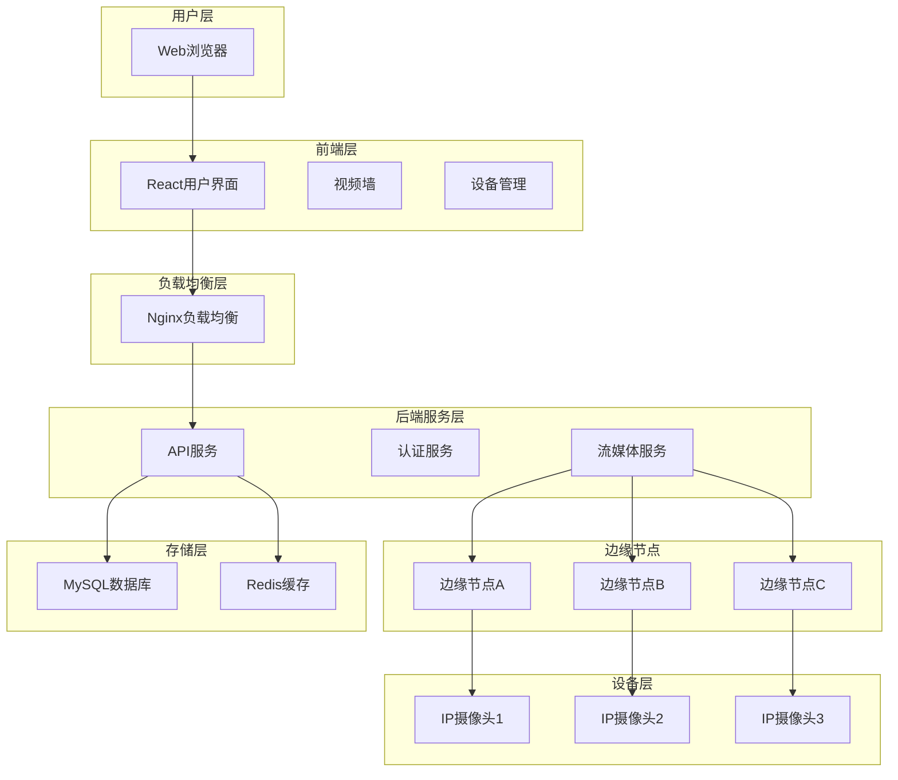

# AICK-MMP 多地区视频监控平台 - 用户操作手册

<div align="center">
  <h2>企业级分布式视频监控解决方案</h2>
  <p>多地区视频监控管理平台用户操作指南</p>
</div>

---

## 📚 目录

1. [系统概述](#1-系统概述)
2. [系统登录](#2-系统登录)
3. [主界面介绍](#3-主界面介绍)
4. [系统监控仪表盘](#4-系统监控仪表盘)
5. [视频墙管理](#5-视频墙管理)
6. [摄像头管理](#6-摄像头管理)
7. [边缘节点管理](#7-边缘节点管理)
8. [录像回放](#8-录像回放)
9. [系统设置](#9-系统设置)
10. [用户管理](#10-用户管理)
11. [常见问题](#11-常见问题)
12. [技术支持](#12-技术支持)

---

## 1. 系统概述

### 1.1 产品介绍

AICK-MMP（AI Camera Kit - Multi-region Monitoring Platform）是一个企业级的多地区视频监控管理平台，专为大规模分布式监控场景设计。系统支持跨地域的摄像头统一管理、实时视频流传输、多画面同时观看和智能运维功能。

### 1.2 核心功能

- **🌍 多地区监控**：支持跨地域摄像头统一管理
- **⚡ 实时视频流**：基于WebRTC技术，延迟<200ms
- **📱 多画面显示**：支持1/4/9/16画面同时观看
- **🔄 边缘计算**：本地视频预处理，减少带宽占用
- **📊 智能运维**：自动故障检测、性能监控
- **🎥 录像回放**：历史录像查看和下载

### 1.3 支持的设备协议

- **RTSP**：标准实时流协议
- **ONVIF**：开放网络视频接口标准
- **GB28181**：国家标准安防协议
- **HTTP流**：基于HTTP的视频流传输

### 1.4 系统架构



---

## 2. 系统登录

### 2.1 访问系统

1. 打开Web浏览器
2. 输入系统访问地址：`http://localhost:80`
3. 系统将自动跳转到登录页面

### 2.2 登录界面

登录界面包含以下元素：
- **系统标题**：多地区监控平台
- **用户名输入框**：输入您的用户名
- **密码输入框**：输入您的密码
- **登录按钮**：点击进行身份验证

### 2.3 默认账户

系统提供以下默认账户：

| 角色 | 用户名 | 密码 | 权限说明 |
|------|--------|------|----------|
| 系统管理员 | admin | admin123 | 完全管理权限 |
| 操作员 | operator | operator123 | 设备操作权限 |
| 观察员 | viewer | viewer123 | 只读观看权限 |

### 2.4 登录流程

1. 在用户名输入框中输入账户名
2. 在密码输入框中输入对应密码
3. 点击"登录"按钮
4. 系统验证成功后将跳转到主界面

> **⚠️ 安全提示**：首次登录后请及时修改默认密码，确保系统安全。

---

## 3. 主界面介绍

### 3.1 界面布局

系统主界面采用经典的左右布局设计：

```
+------------------+----------------------------------------+
|      侧边栏       |              主内容区                   |
|                  |                                        |
|   • 系统监控      |                                        |
|   • 视频墙       |              页面内容                   |
|   • 摄像头管理    |                                        |
|   • 边缘节点      |                                        |
|   • 录像回放      |                                        |
|   • 系统设置      |                                        |
|   • 用户资料      |                                        |
+------------------+----------------------------------------+
|                     顶部导航栏                            |
+--------------------------------------------------------+
```

### 3.2 顶部导航栏

顶部导航栏包含以下功能：
- **菜单折叠按钮**：展开/收起侧边栏
- **系统标题**：显示当前模块名称
- **通知铃铛**：系统告警和通知
- **用户头像**：用户信息和退出登录

### 3.3 侧边栏菜单

| 菜单项 | 图标 | 功能描述 |
|--------|------|----------|
| 系统监控 | 📊 | 查看系统整体运行状态 |
| 视频墙 | 📺 | 多画面视频实时观看 |
| 摄像头管理 | 📹 | 设备添加、配置、状态管理 |
| 边缘节点 | 🌐 | 边缘计算节点管理 |
| 录像回放 | ⏯️ | 历史录像查看和下载 |
| 系统设置 | ⚙️ | 系统参数配置 |
| 用户资料 | 👤 | 个人信息管理 |

### 3.4 快捷操作

- **快捷键**：
  - `Ctrl + /`：显示快捷键帮助
  - `Ctrl + Shift + R`：刷新当前页面
  - `F11`：全屏模式
- **鼠标操作**：
  - 单击菜单项：切换页面
  - 右键点击：显示上下文菜单

---

## 4. 系统监控仪表盘

### 4.1 功能概述

系统监控仪表盘是系统的总控台，提供全局的设备状态、系统性能和运行情况的实时监控。

### 4.2 统计卡片

#### 4.2.1 摄像头状态
- **显示内容**：在线摄像头数量 / 总摄像头数量
- **进度条**：在线率百分比
- **状态指示**：绿色（100%在线）、橙色（部分在线）

#### 4.2.2 边缘节点
- **显示内容**：在线节点数量 / 总节点数量
- **进度条**：节点在线率
- **状态指示**：节点连接状态

#### 4.2.3 视频流状态
- **显示内容**：活跃视频流 / 总视频流
- **进度条**：流媒体活跃度
- **状态指示**：流传输状态

#### 4.2.4 在线用户
- **显示内容**：当前在线用户数量
- **实时更新**：用户登录/退出实时统计

### 4.3 系统告警

#### 4.3.1 告警类型
- **🔴 错误告警**：系统严重故障，需要立即处理
- **🟡 警告告警**：系统异常，建议关注处理
- **🟢 信息告警**：系统正常运行信息

#### 4.3.2 告警示例
- 边缘节点连接不稳定
- 摄像头设备离线
- 系统自动备份完成
- 存储空间不足警告

### 4.4 系统活动

实时显示系统操作日志：
- **设备管理**：摄像头添加、删除、配置变更
- **流媒体**：视频流启动、停止、切换
- **用户操作**：用户登录、权限变更
- **系统维护**：节点重启、系统更新

### 4.5 操作指南

1. **查看详细信息**：点击统计卡片查看详细统计
2. **处理告警**：点击告警项目查看详细信息和处理建议
3. **导出报告**：点击右上角导出按钮生成系统报告
4. **设置刷新频率**：在设置中调整数据刷新间隔

---

*注：本手册将继续在下一部分详细介绍视频墙管理、设备管理等功能模块的具体操作方法。*# AICK-MMP 多地区视频监控平台 - 用户操作手册

<div align="center">
  <h2>企业级分布式视频监控解决方案</h2>
  <p>多地区视频监控管理平台用户操作指南</p>
</div>

---

## 📚 目录

1. [系统概述](#1-系统概述)
2. [系统登录](#2-系统登录)
3. [主界面介绍](#3-主界面介绍)
4. [系统监控仪表盘](#4-系统监控仪表盘)
5. [视频墙管理](#5-视频墙管理)
6. [摄像头管理](#6-摄像头管理)
7. [边缘节点管理](#7-边缘节点管理)
8. [录像回放](#8-录像回放)
9. [系统设置](#9-系统设置)
10. [用户管理](#10-用户管理)
11. [常见问题](#11-常见问题)
12. [技术支持](#12-技术支持)

---

## 1. 系统概述

### 1.1 产品介绍

AICK-MMP（AI Camera Kit - Multi-region Monitoring Platform）是一个企业级的多地区视频监控管理平台，专为大规模分布式监控场景设计。系统支持跨地域的摄像头统一管理、实时视频流传输、多画面同时观看和智能运维功能。

### 1.2 核心功能

- **🌍 多地区监控**：支持跨地域摄像头统一管理
- **⚡ 实时视频流**：基于WebRTC技术，延迟<200ms
- **📱 多画面显示**：支持1/4/9/16画面同时观看
- **🔄 边缘计算**：本地视频预处理，减少带宽占用
- **📊 智能运维**：自动故障检测、性能监控
- **🎥 录像回放**：历史录像查看和下载

### 1.3 支持的设备协议

- **RTSP**：标准实时流协议
- **ONVIF**：开放网络视频接口标准
- **GB28181**：国家标准安防协议
- **HTTP流**：基于HTTP的视频流传输

### 1.4 系统架构


---

## 2. 系统登录

### 2.1 访问系统

1. 打开Web浏览器
2. 输入系统访问地址：`http://localhost:80`
3. 系统将自动跳转到登录页面

### 2.2 登录界面

登录界面包含以下元素：
- **系统标题**：多地区监控平台
- **用户名输入框**：输入您的用户名
- **密码输入框**：输入您的密码
- **登录按钮**：点击进行身份验证

### 2.3 默认账户

系统提供以下默认账户：

| 角色 | 用户名 | 密码 | 权限说明 |
|------|--------|------|----------|
| 系统管理员 | admin | admin123 | 完全管理权限 |
| 操作员 | operator | operator123 | 设备操作权限 |
| 观察员 | viewer | viewer123 | 只读观看权限 |

### 2.4 登录流程

1. 在用户名输入框中输入账户名
2. 在密码输入框中输入对应密码
3. 点击"登录"按钮
4. 系统验证成功后将跳转到主界面

> **⚠️ 安全提示**：首次登录后请及时修改默认密码，确保系统安全。

---

## 3. 主界面介绍

### 3.1 界面布局

系统主界面采用经典的左右布局设计：

```
+------------------+----------------------------------------+
|      侧边栏       |              主内容区                   |
|                  |                                        |
|   • 系统监控      |                                        |
|   • 视频墙       |              页面内容                   |
|   • 摄像头管理    |                                        |
|   • 边缘节点      |                                        |
|   • 录像回放      |                                        |
|   • 系统设置      |                                        |
|   • 用户资料      |                                        |
+------------------+----------------------------------------+
|                     顶部导航栏                            |
+--------------------------------------------------------+
```

### 3.2 顶部导航栏

顶部导航栏包含以下功能：
- **菜单折叠按钮**：展开/收起侧边栏
- **系统标题**：显示当前模块名称
- **通知铃铛**：系统告警和通知
- **用户头像**：用户信息和退出登录

### 3.3 侧边栏菜单

| 菜单项 | 图标 | 功能描述 |
|--------|------|----------|
| 系统监控 | 📊 | 查看系统整体运行状态 |
| 视频墙 | 📺 | 多画面视频实时观看 |
| 摄像头管理 | 📹 | 设备添加、配置、状态管理 |
| 边缘节点 | 🌐 | 边缘计算节点管理 |
| 录像回放 | ⏯️ | 历史录像查看和下载 |
| 系统设置 | ⚙️ | 系统参数配置 |
| 用户资料 | 👤 | 个人信息管理 |

### 3.4 快捷操作

- **快捷键**：
  - `Ctrl + /`：显示快捷键帮助
  - `Ctrl + Shift + R`：刷新当前页面
  - `F11`：全屏模式
- **鼠标操作**：
  - 单击菜单项：切换页面
  - 右键点击：显示上下文菜单

---

## 4. 系统监控仪表盘

### 4.1 功能概述

系统监控仪表盘是系统的总控台，提供全局的设备状态、系统性能和运行情况的实时监控。

### 4.2 统计卡片

#### 4.2.1 摄像头状态
- **显示内容**：在线摄像头数量 / 总摄像头数量
- **进度条**：在线率百分比
- **状态指示**：绿色（100%在线）、橙色（部分在线）

#### 4.2.2 边缘节点
- **显示内容**：在线节点数量 / 总节点数量
- **进度条**：节点在线率
- **状态指示**：节点连接状态

#### 4.2.3 视频流状态
- **显示内容**：活跃视频流 / 总视频流
- **进度条**：流媒体活跃度
- **状态指示**：流传输状态

#### 4.2.4 在线用户
- **显示内容**：当前在线用户数量
- **实时更新**：用户登录/退出实时统计

### 4.3 系统告警

#### 4.3.1 告警类型
- **🔴 错误告警**：系统严重故障，需要立即处理
- **🟡 警告告警**：系统异常，建议关注处理
- **🟢 信息告警**：系统正常运行信息

#### 4.3.2 告警示例
- 边缘节点连接不稳定
- 摄像头设备离线
- 系统自动备份完成
- 存储空间不足警告

### 4.4 系统活动

实时显示系统操作日志：
- **设备管理**：摄像头添加、删除、配置变更
- **流媒体**：视频流启动、停止、切换
- **用户操作**：用户登录、权限变更
- **系统维护**：节点重启、系统更新

### 4.5 操作指南

1. **查看详细信息**：点击统计卡片查看详细统计
2. **处理告警**：点击告警项目查看详细信息和处理建议
3. **导出报告**：点击右上角导出按钮生成系统报告
4. **设置刷新频率**：在设置中调整数据刷新间隔

---

*注：本手册将继续在下一部分详细介绍视频墙管理、设备管理等功能模块的具体操作方法。*